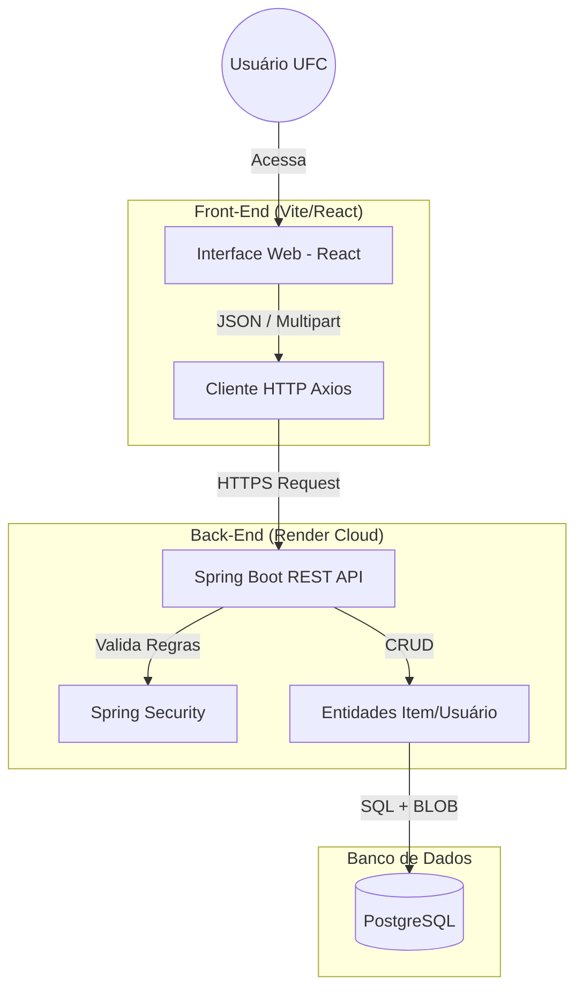

# 🔍 Achados e Perdidos - UFC (Campus Russas)


Plataforma centralizada para gestão, reporte e recuperação de objetos perdidos na Universidade Federal do Ceará. O projeto visa substituir os grupos de mensagens informais por um sistema seguro, visual e organizado.

## 📸 Visão Geral

O sistema resolve o problema da descentralização de informações sobre itens perdidos no campus. Através de uma interface moderna e responsiva, alunos podem reportar itens encontrados (com fotos) ou buscar pertences perdidos.

> 🔒 **Segurança:** O sistema conta com validação que restringe o cadastro apenas a usuários com e-mail institucional (`@alu.ufc.br` ou `@ufc.br`).

## 🏗️ Arquitetura do Sistema



```markdown
## 🚀 Tecnologias Utilizadas

O projeto foi desenvolvido seguindo a arquitetura **SPA (Single Page Application)**.

### 🧠 Back-End (API REST)
* **Java 21:** Linguagem base (LTS).
* **Spring Boot 3:** Framework principal.
* **Spring Data JPA:** Persistência de dados.
* **Spring Security:** Configuração de CORS e Segurança.
* **PostgreSQL:** Banco de dados relacional (Armazenamento de dados e imagens via BLOB).
* **Maven:** Gerenciamento de dependências.
* **Render:** Hospedagem em nuvem (Deploy).

### 🎨 Front-End (Interface)
* **React.js:** Biblioteca para interface do usuário.
* **Vite:** Build tool de alta performance.
* **Tailwind CSS:** Estilização utilitária e responsiva.
* **Axios:** Integração com a API.
* **Lucide React:** Biblioteca de ícones.

## ⚙️ Funcionalidades

1.  **Cadastro e Login Institucional**
    * Validação automática de domínio de e-mail universitário.
2.  **Reportar Item (Achado ou Perdido)**
    * Upload de imagem do item (armazenado no banco).
    * Categorização (Eletrônicos, Documentos, etc.).
    * Definição de local (Bloco, Sala).
3.  **Feed de Itens**
    * Listagem visual com cards.
    * Indicadores de status (Perdido, Achado, Devolvido).
4.  **Devolução**
    * Fluxo para marcar item como "Recuperado/Devolvido".

## 🔧 Como Executar o Projeto Localmente

### Pré-requisitos
* Java JDK 21
* Node.js e NPM
* PostgreSQL

### 1. Back-End (API)

```bash
# Clone o repositório
git clone [https://github.com/K4ioedu/achados-perdidos-backend.git](https://github.com/K4ioedu/achados-perdidos-backend.git)

# Acesse a pasta
cd achados-perdidos-backend

# Instale as dependências e rode
mvn spring-boot:run

# Abra um novo terminal e acesse a pasta do frontend
cd frontend

# Instale as dependências
npm install

# Inicie o servidor de desenvolvimento
npm run dev

👥 Autores
Trabalho desenvolvido para a disciplina de Desenvolvimento de Software para Web - Ciência da Computação (UFC).

Gustavo Ítalo Teixeira Marques
Kaio Eduardo Fontenele Gomes
Diego Cavalcante Diniz Maia
Vitor Manoel Silva de Oliveira
Kelve Monteiro Cartaxo

📄 Licença
Este projeto é de cunho educacional.

